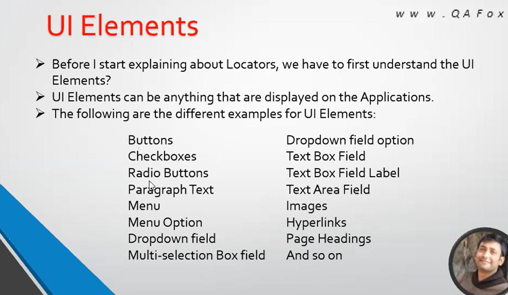
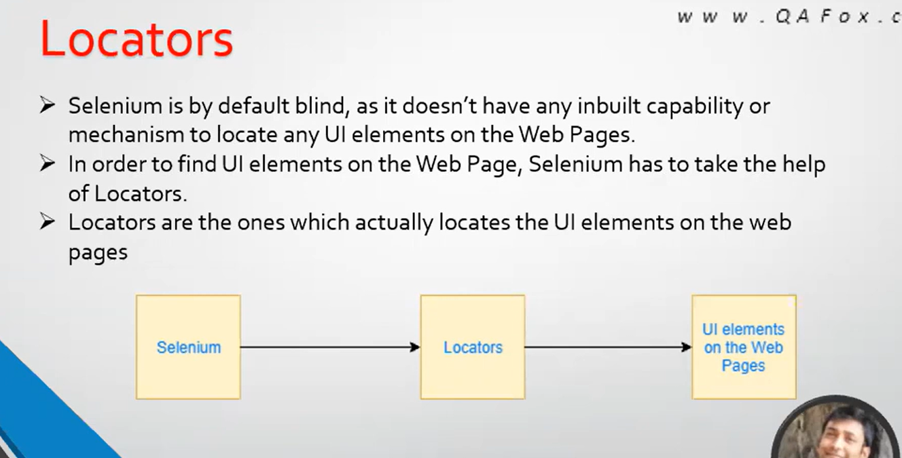
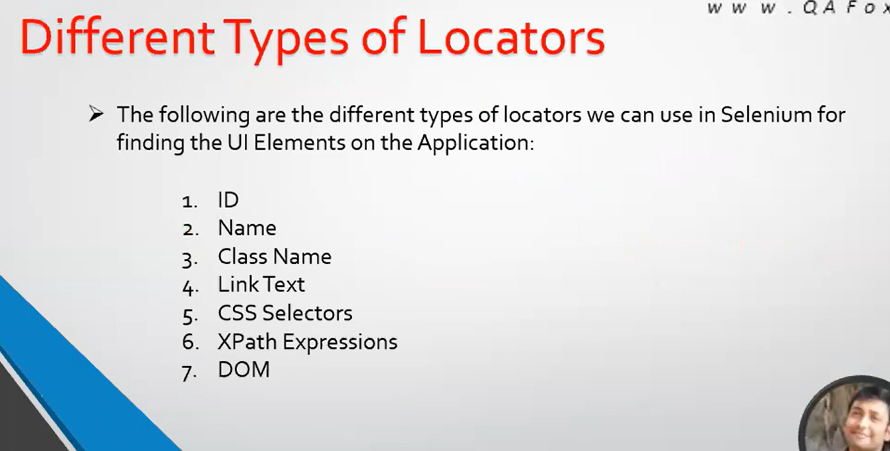
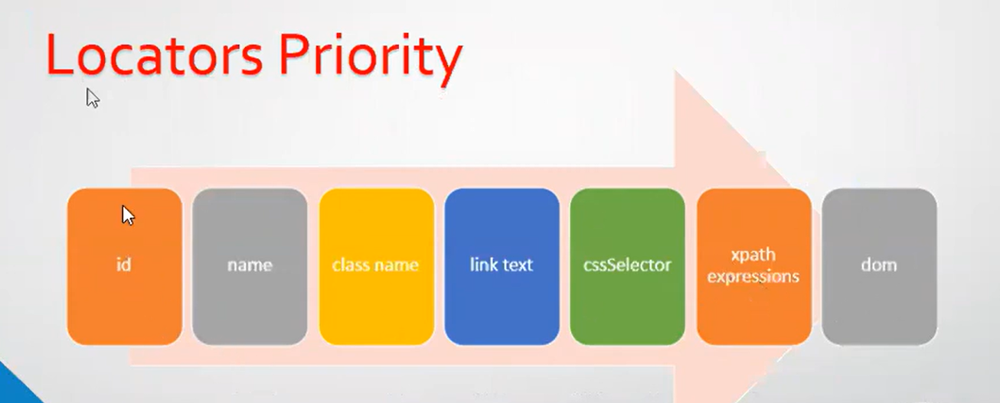
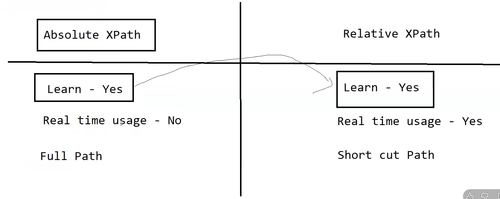

# Locators
With locators we are able to locate ui elemnts on webpage.

# 1. Locators

# 1.1 Different types of locator

~~~
Note: below locators are present inside html elemnt as attribute, to find these locators we have to inspect html code.

1. id = "Value"
eg. <button id="but2" type="button" contenteditable="true">Button2</button>

2. name = "Value"
eg. <button name="samename" type="button">Login</button>

3. class = "Value"
eg. 

4. Link text = "text between anchor tag"
eg. <a id="selenium143" href="http://www.Selenium143.blogspot.com" target="_blank">http://www.Selenium143.blogspot.com</a>

5. css selector = css selector value of ui elemnt

6. xpath = xpath value of ui element

7. Dom locator
eg. dom =document.getElementById("but1")
<button id="but1" type="button" disabled="">Button1</button>
~~~

# 1.2 priority of locators

# 2. Xpath
- Q. why xpath is so powerfull?
    - Ans. Because xpath can locate almost all types of ui elements.

# 2.1 xpath locators types

~~~
<!DOCTYPE html>
<html lang="en">
<head>
    <meta charset="UTF-8">
    <meta name="viewport" content="width=device-width, initial-scale=1.0">
    <title>local_site</title>
</head>
<body>
    
this is para 

    
this is para2

</body>
</html>
~~~

# 2.2 absolute xpath

- Using XPath Expressions, we can navigate through the HTML code and locate the desired element.
- Absolute XPath tries to locates the element from the root. i.e. complete path.
- The below examples will help us in understanding the Absolute XPath Expressions:
Demo site :: http://compendiumdev.co.uk/selenium/basic_web_page.html
- / – locates the entire HTML document
- /html – locates the complete HTML code
- /html/head – locates the head portion of HTML code
- /html/head/title – locates the title portion of head section
- /html/body – locates the body portion of HTML code
- /html/body/p – locates all the p tags in the body portion
- /html/body/p[1] – locates the first p tag
- /html/body/p[2] – locates the second p tag
- All p tags having id ‘para1′ – /html/body/p[@id=’para1’]
- All p tags having id ‘para2′ – /html/body/p[@id=’para2’]
- All p tags having class ‘main’ – /html/body/p[@class=’main’]
- All p tags having class ‘sub’ – /html/body/p[@class=’sub’]
- All p tags having id as ‘para1’ and class as ‘main’ ,both id should available as attribute otherwise it will locate 0 element– /html/body/p[@id=’para1′][@class=’main’] 

# 2.3 disadvantages of absolute xpath
- if ui elements move from one place to another place on webpage then previous automation script absolute path will give error.
- to much rework require
- script corrupt
- to much mainatanance require
- not recommended in real time

# 2.4 relative xpath locator
- Q. why relative xpath ?
    - to avoid absolute xpath dynamic ui elemnt  changes ,relative xpath is more stable 
- Unlike Absolute XPath, Relative XPath tries to locate the element directly instead of locating from root.
- The below examples will help us in understanding the Relative XPath Expressions:
Demo site :: http://compendiumdev.co.uk/selenium/basic_web_page.html
- Generally Relative XPath Expression starts with ‘//”
- //html – locates the complete HTML code
- //head – locates the head portion of HTML code directly
- //body – locates the body portion of HTML code directly
- //title – locate the title portion of HTML code directly
- //p – locates all the Paragraphs on the page
- //p[1] – locates the first paragraph
- //p[2] – locates the second paragraph
- //p[@id=’para1′] – locates the paragraph having the id attribute value as ‘para1’
- //p[@id=’para2′] – locates the paragraph having the id attribute value as ‘para2’
- //p[@class=’main’] – locates the paragraph having the class attribute value as ‘main’
- //p[@class=’sub’] – locates the paragraph having the class attribute value as ‘sub’
- //p[@id=’para1′][@class=’main’] – locates all the p tags having id as ‘para1’ and class as ‘main’

# 2.5 more examples on xpath part 1 
- interview points
 ~~~
 Note1: or used find locate with same html tag

//p[@id= "para1" or @id="para2"]

 Note2: pipe symbol | used to find multiple elements with different tag,here or is not possible 

 //p[@id= "para1" ] | //h1[@id="head1"]

 Note3: //input[1] this will locate all  first input tag elemnt of every parent tag present on html page 

 Note3: (//input)[1] this will locate first input tag element on page level ,not on parent tag level

 Note3: finding elemnt with multi attribute ,if both attribute not present then it locates zero elemnt
 //p[@id="para1"][@class="sub"]
 ~~~

- Demonstrate at http://compendiumdev.co.uk/selenium/basic_web_page.html
- All p tags having ids as ‘para1’ | ‘para2′ 
    - //p[@id=’para1’] | //p[@id=’para2′]
- All p tags having ids as ‘para1’ or ‘para2′ 
    - //p[@id=’para1′ or @class=’sub’]
- Demonstrate at http://omayo.blogspot.in/
    - All the input tags inside the HTML page – //input
    - Observe that matching nodes are 34
    - Observe that all the matching nodes are highlighted
- Finding the first input tag inside the HTML page      
    - (//input)[1]
- Finding the eighth input tag inside the HTML page    
    - (//input)[8]
- Finding the last input tag inside the HTML page 
    - (//input)[34]
- Finding the input tags having name attribute 
    - //input[@name]
- Finding the input tags using its attribute name and value 
    - //input[@value=’orange’]
- Finding the input tags using multiple attribute names and values 
    - //input[@name=’color’][@value=’blue’]
- Finding the input tags having checked attribute 
    - //input[@checked]
- All the image tags inside the HTML page 
    - //img
- Finding an image element using its attribute values   
    - //img[@height=”200px”]
- Finding an drop down field having class ‘combobox’ and also an hyper link having value ‘link2′ 
    - //select[@class=’combobox’] | //a[@value=’link2′]
- Finding hyper link having id=’link1′ and also the hyper link having value=’link2′ 
    - //a[@id=’link1′ or @value=’link2′]
- Finding ‘button’ tags having id ‘but2′  
    - //button[@id=’but2’]
- Finding any tags having id ‘but2′ 
    - //*[@id=’but2’]
- Finding ‘button’ tags having any attribute value as ‘but2′ 
    - //button[@*=’but2’]
- Finding ‘button’ tags having id attribute with any value 
    - //button[@id]
- Finding ‘input’ tags having name attribute as ‘gender’ 
    - //input[@name=’gender’]
- Finding the first ‘input’ tags having name attribute as ‘gender’ 
    - //input[@name=’gender’][1]
- Finding the second ‘input’ tags having name attribute as ‘gender’ 
    - //input[@name=’gender’][2]
- Finding any tags having name attribute as ‘gender’ 
    - //*[@name=’gender’]
- Finding ‘input’ tags having any attribute value as ‘gender’  
    -  //input[@*=’gender’]
- Finding any tags having any attribute value as ‘gender’ 
    - //*[@*=’gender’]
- Finding ‘input’ tags having name attribute value as anything 
    - //input[@name]
- Finding any tags having any attribute value as anything 
    -  //*[@*]havi
- Finding any elements having id attribute value as ‘radio1’ and name attribute value as ‘gender’ 
    - //*[@id=’radio1′][@name=’gender’]
- Finding the first ‘input’ tags having name attribute as ‘gender’ and is the first element 
    - //input[@name=’gender’][1]
- Finding the second ‘input’ tags having name attribute as ‘gender’ and is the second element  
    - //input[@name=’gender’][2]
- Finding any elements having id attribute value as ‘radio1’ or name attribute value as ‘gender’ 
    - //*[@id=’radio1′ or @name=’gender’]

# 2.6  XPath Expressions – Part 2 – Demonstrate at http://omayo.blogspot.in/
- Find all the hyper links in the page 
    - //a
- Find all the hyper links having URL ‘http://www.Selenium143.blogspot.com’ 
    - //a[@href=’http://www.Selenium143.blogspot.com’]
- Find the first hyper link having URL ‘http://www.Selenium143.blogspot.com’ 
    - (//a[@href=’http://www.Selenium143.blogspot.com’])[1]
- Find the third hyper link having URL ‘http://www.Selenium143.blogspot.com’ 
    - (//a[@href=’http://www.Selenium143.blogspot.com’])[3]
- Difference between 
    - (//a[@href=’http://www.Selenium143.blogspot.com’])[3] and //a[@href=’http://www.Selenium143.blogspot.com’][3]
    - Second XPath searches for the third element at tag level
    - First XPath searches for the third element at page level
- Find first child of ‘html’ tag 
    - //html/*[1]
- Find second child of ‘html’ tag 
    - //html/*[2]
- Find first child of ‘body’ tag 
    - //body/*[1]
- Find second child of ‘body’ tag 
    - //body/*[2]

# 2.7 xpath function part 1
## 1. text() – Demonstrate at http://omayo.blogspot.in/
- Find the p tags having the exact text ‘PracticeAutomationHere’ 
	-  //p[text()=’PracticeAutomationHere’]
- Use . instead of text() – Find the p tag having the exact text ‘PracticeAutomationHere’ 
	-  //p[.=’PracticeAutomationHere’]

## 2. contains() – Demonstrate at http://omayo.blogspot.in/
Purpose:
- It is used when the value of any attribute changes dynamically.
- Has the ability to find the elements with partial text
- If part of the attribute value is changing dynamically i.e. id=’123main123′ to id=’456main456′, we can use //tagName[contains(@id,’main’)] to locate such dynamically changing attribute values.
- Find the input tag having the text ‘ra’ inside its value attribute text 
	-  //input[contains(@value,’ra’)]
- Find the p tag containing the text ‘Automation’  
	- //p[contains(text(),’Automation’)]
- Find the p tag containing the text ‘Automation’ using.
	- //p[contains(.,’Automation’)]
## 3. starts-with()
- It is used when the value of any attribute changes dynamically.
- Has the ability to find the elements with partial text i.e. initial partial text
- If part of the attribute value is changing dynamically i.e. id=’main123′ to id=’main456′, we can use //tagName[starts-with(@id,’main’)] to locate such dynamically changing attribute values.
- Find the input tag having the value attribute text starting with letter ‘o’ 
    -  //input[starts-with(@value,’o’)]
- Find the p tag starting with text ‘Practice’ 
    - //*[starts-with(text(),’Practice’)]
- Find the p tag starting with text ‘Practice’ using . 
    -  //*[starts-with(.,’Practice’)]
# 2.8 XPath functions: Part2 (Demonstrate at http://compendiumdev.co.uk/selenium/basic_web_page.html )
## 4. last()
- Find the first child of ‘body’ tag 
    -  //body/*[1]
- last() – Find the last child of ‘body’ tag 
    - //body/*[last()]
- Find the first ‘p’ tag 
    - //p[1]
- last() – Find the last ‘p’ tag 
    -  //p[last()]
- Find the last but one ‘p’ tag 
    - //p[last()-1]
- Locate the last but 2 input tag 
    - (//input)[last()-2]  (Demonstrate at http://omayo.blogspot.in/ )
- Find second ‘p’ tag having class ‘sub’ 
    - //p[2][@class=’sub’]
- Find the last ‘p’ tag having class ‘sub’ 
    - //p[last()][@class=’sub’]
- Find the last but one ‘p’ tag having class ‘main’ 
    -  //p[last()-1][@class=’main’]
# 2.9 XPath functions: Part3 (Demonstrate at http://compendiumdev.co.uk/selenium/basic_web_page.html )
## 5. position() – Find the first ‘p’ tag – //p[position()=1]
- position() – Find the second ‘p’ tag 
    - //p[position()=2]
- position() – Find the 8th input tag 
    - (//input)[position()=8]   
- (Demonstrate at http://omayo.blogspot.in/ )
